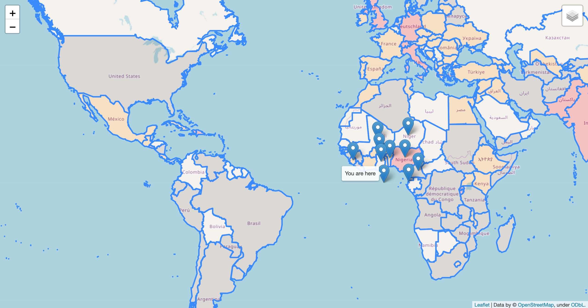

# Movie Map Generator

## About
### Movie map generator module
This project is designed to show the user the nearest locations of the movies filmed in a certain year based on his location.
The movie_map_generator.py module processes location.list file and creates the html page with a map, which contains up to ten nearest locations to the user.
For every location there is a film that represents it. 
### Population density layer module
There is also a second layer to the map and it colors the map according to population density in that country. 
Color code:
   - white - 0 to 100 persons per sq. km
   - gray - 100 to 500 persons per sq. km
   - orange - 500 - 1500 persons per sq. km
   - red - more than 1500 persons per sq. km

### Location loader module
The project also contains a second module location_loader.py which is designed to load coordinates of unique locations to a file location_geodata.csv. 
This is done with the help of geocoder library and OpenStreetMap service.
The location_loader.py module is resilient geo coding service outages and can be restarted to load rest of the data.
The project already has preloaded data about location's coordinates in location_geodata.csv, so there's no need to run the module.
Though it can be useful for loading geodata from a different provider (such as google, ect.)
## How can it be useful?

It’s would be useful for any movie locations research, as it is easy to use and a good way of visualizing information.
It also useful for comparing the population density, which is another tile the map has, to density of movies shot near a certain location.

## How does it work?

This is an example of how the program works.

```Please enter a year you would like to have a map for: 2014
Your latitude: 49.87654
Your longitude: 24.03245
The map is loading...
Please wait...
You can find your map here: 'map.html' 
```


More examples of the generated maps.




## Structure of map.html

File map.html is composed of:

`<head>` - a header that contains references to scripts, styles and links provided by folium library.
	
	<meta> - contains metadata - descriptory information about the data in file.
	<script> - contains references to modules of code that are imbedded into the page by folium library.
	<link> - contains links to a cascade styling sheets that are embedded in the page.
	<style> - contains additional style instructions for the specific page, including scale of the 		map.
`<body>` - The main body of the page, that includes only a section of embedded code that references the object of folium’s map.


`<script>` - contains sections of code that include markers of the locations on the given coordinates and also user’s location. 
There is also a function that colors out the map according to information that is presented in world.json.

